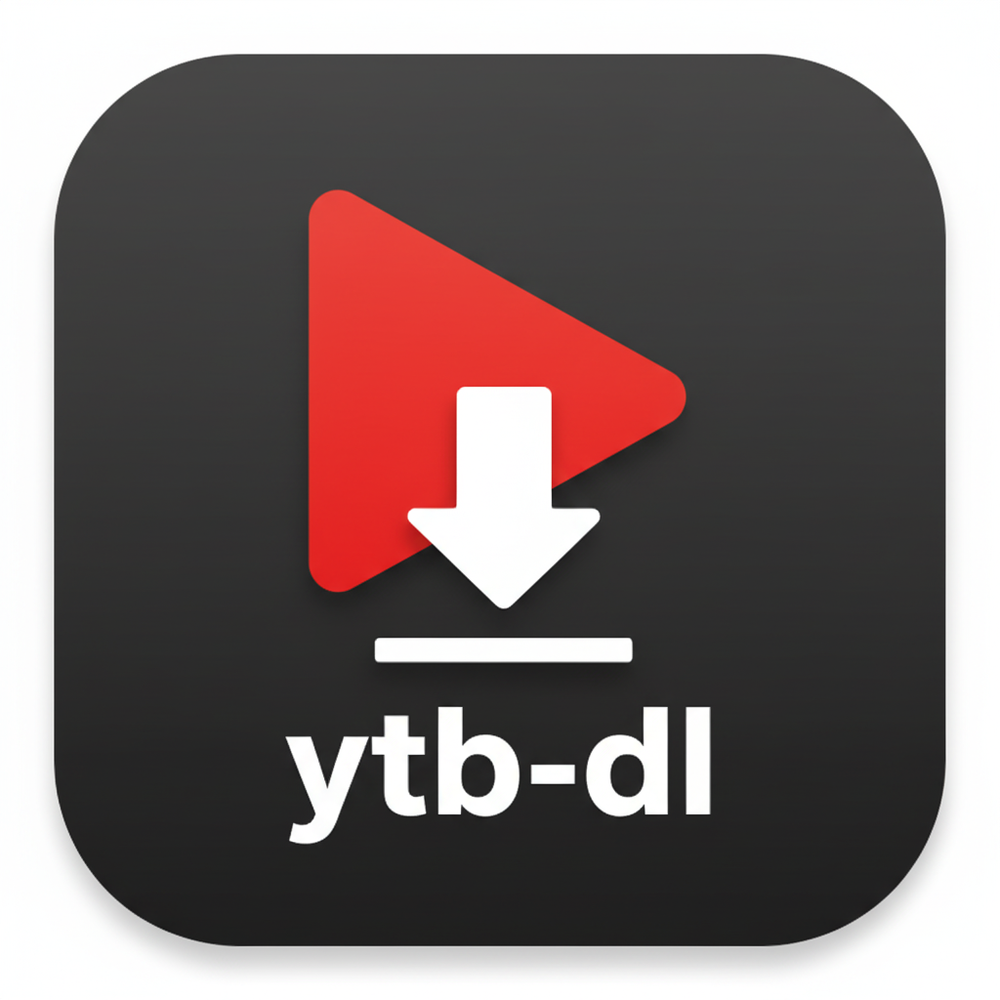

# YouTube Video Downloader

<div align="center">
  
</div>

[](https://github.com/thsrite/ytb-dl/actions)
[](https://hub.docker.com/r/thsrite/ytb-dl)
[](https://opensource.org/licenses/MIT)
[](https://www.python.org/downloads/)

一个功能强大的 YouTube 视频下载器，集成企业微信应用交互下载、通知、多格式支持、实时进度监控和现代化 Web 界面。基于 FastAPI 和 yt-dlp 构建，支持 Docker 部署和源码部署。


## ✨ 功能特性

### 🎥 视频下载
- 支持多种视频质量（4K, 1080p, 720p, 480p, 360p）
- 智能格式选择（MP4+M4A 优先）
- 自动合并音视频轨道
- 文件大小智能预估

### 🎵 音频提取
- 高质量音频提取（M4A, MP3）
- 自定义音频比特率
- 保留原始音频质量

### 📱 企业微信集成
- 企业微信应用交互下载
- 下载完成自动推送
- 视频缩略图展示
- 新闻卡片式消息
- 403/网络错误实时通知
- 管理员通知系统
- Cookie 同步状态推送

### 💻 Web 界面
- 现代化玻璃拟态设计
- 响应式移动端适配
- 实时进度监控
- 2x2 网格移动布局
- 视频播放预览
- 批量删除下载历史
- Cookie 状态实时显示

### 🔧 高级特性
- Cookie 支持（突破地区限制）
- CookieCloud 自动同步
- 浏览器 Cookie 提取
- 代理服务器配置
- 自定义 yt-dlp 参数
- 下载历史管理
- 多并发下载
- yt-dlp 在线更新
- 智能错误重试机制
- 统一消息模板系统

## 🛠️ 技术栈

| 分类 | 技术 | 说明 |
|------|------|------|
| **后端框架** | FastAPI | 现代化 Python Web 框架 |
| **下载引擎** | yt-dlp | 强大的媒体下载工具 |
| **前端技术** | HTML5 + CSS3 + JavaScript | 现代化 Web 技术 |
| **实时通信** | WebSocket | 下载进度实时推送 |
| **企业通信** | WeChat Work API | 企业微信消息推送 |
| **容器化** | Docker | 轻量级部署方案 |
| **CI/CD** | GitHub Actions | 自动化构建和部署 |

## 📁 项目结构

```
ytb_dl/
├── 🚀 main.py                    # FastAPI 应用入口
├── 📦 ytb/                       # 核心业务包
│   ├── __init__.py               # 包初始化
│   ├── config.py                 # 配置管理
│   ├── downloader.py             # 下载核心逻辑
│   ├── history_manager.py        # 历史记录管理
│   ├── browser_cookies.py        # 浏览器Cookie提取
│   ├── cookiecloud.py            # CookieCloud同步
│   └── updater.py                # yt-dlp更新管理
├── 💬 wecom/                     # 企业微信集成
│   ├── __init__.py
│   ├── client.py                 # WeChat Work 客户端
│   ├── service.py                # 消息推送服务
│   ├── crypto.py                 # 消息加密解密
│   └── message_templates.py      # 统一消息模板
├── 🎨 frontend/                  # 前端资源
│   ├── index.html                # 主界面
│   ├── css/styles.css            # 样式文件
│   └── js/app.js                 # 交互逻辑
├── ⚙️ config/                    # 配置文件目录
│   ├── config.json               # 主配置文件
│   ├── cookies.txt               # YouTube Cookies
│   └── download_history.json     # 下载历史
├── 📥 downloads/                 # 下载文件存储
├── 🐳 Docker 相关
│   ├── Dockerfile                # Docker 镜像构建
│   ├── docker-compose.yml        # 服务编排
│   └── docker-entrypoint.sh      # 容器启动脚本
├── 🔧 .github/workflows/         # CI/CD 流水线
│   ├── docker-build.yml          # 镜像构建发布
│   └── release.yml               # 版本发布
└── 📄 requirements.txt           # Python 依赖包
```

## 🚀 快速开始

### 方法一：Docker 部署（推荐）

```bash
# 1. 拉取并运行最新镜像
docker run -d \
  --name ytb-downloader \
  -p 9832:9832 \
  -v ./downloads:/app/downloads \
  -v ./config:/app/config \
  thsrite/ytb-dl:latest

# 2. 或使用 docker-compose
curl -O https://raw.githubusercontent.com/thsrite/ytb-dl/main/docker-compose.yml
docker-compose up -d

# 3. 访问应用
open http://localhost:9832
```

### 方法二：源码部署

#### 环境要求
- Python 3.12+
- ffmpeg（音视频处理）
- Git

#### 安装步骤

```bash
# 1. 克隆仓库
git clone https://github.com/thsrite/ytb-dl.git
cd ytb-dl

# 2. 创建虚拟环境
python -m venv venv
source venv/bin/activate  # Linux/Mac
# Windows: venv\Scripts\activate

# 3. 安装依赖
pip install -r requirements.txt

# 4. 安装 ffmpeg
# Ubuntu/Debian
sudo apt update && sudo apt install ffmpeg

# macOS
brew install ffmpeg

# Windows
# 下载 https://ffmpeg.org/download.html 并配置 PATH

# 5. 启动服务
python main.py
# 或使用 uvicorn
uvicorn main:app --host 0.0.0.0 --port 9832

# 6. 访问应用
open http://localhost:9832
```

### 🐳 Docker 镜像标签

| 标签 | 描述 | 适用场景 |
|------|------|----------|
| `latest` | 最新稳定版 | 生产环境推荐 |
| `v1.0.0` | 指定版本 | 版本锁定部署 |
| `main` | 主分支最新 | 测试新功能 |

### 🔧 环境变量配置

```bash
# Docker 运行时可配置的环境变量
docker run -d \
  -e PYTHONPATH=/app \
  -e PYTHONUNBUFFERED=1 \
  -p 9832:9832 \
  thsrite/ytb-dl:latest
```

## 📚 API 文档

### 🔍 视频信息获取

```http
POST /api/video/info
Content-Type: application/json

{
  "url": "https://www.youtube.com/watch?v=dQw4w9WgXcQ"
}
```

**响应示例：**
```json
{
  "id": "dQw4w9WgXcQ",
  "title": "Rick Astley - Never Gonna Give You Up",
  "duration": 212,
  "uploader": "RickAstleyVEVO",
  "view_count": 1000000000,
  "thumbnail": "https://i.ytimg.com/vi/dQw4w9WgXcQ/maxresdefault.jpg",
  "formats": [
    {
      "format_id": "137+140",
      "format_note": "1080p+128k",
      "ext": "mp4",
      "filesize": 89641234,
      "resolution": "1920x1080"
    }
  ]
}
```

### ⬇️ 视频下载

```http
POST /api/download
Content-Type: application/json

{
  "url": "https://www.youtube.com/watch?v=dQw4w9WgXcQ",
  "format_id": "bestvideo[ext=mp4]+bestaudio[ext=m4a]"
}
```

### 📊 下载进度（WebSocket）

```javascript
const ws = new WebSocket('ws://localhost:9832/ws');
ws.onmessage = function(event) {
  const data = JSON.parse(event.data);
  if (data.type === 'download_progress') {
    console.log(`进度: ${data.progress.percent}%`);
  }
};

// 进度数据格式
{
  "type": "download_progress",
  "data": {
    "task_id": "uuid-string",
    "progress": {
      "percent": 67.5,
      "speed": "2.3MB/s",
      "eta": 45,
      "downloaded_bytes": 45678900,
      "total_bytes": 67890000,
      "phase": "downloading_video"
    },
    "status": "downloading"
  }
}
```

### 📝 历史记录管理

```http
# 获取历史记录
GET /api/history?limit=10&offset=0

# 删除历史记录
DELETE /api/history/{task_id}

# 清理历史记录
POST /api/history/cleanup?days=30
```

### ⚙️ 配置管理

```http
# 获取当前配置
GET /api/config

# 更新配置
POST /api/config
Content-Type: application/json

{
  "wecom": {
    "corp_id": "your_corp_id",
    "app_secret": "your_app_secret",
    "agent_id": 1000001
  },
  "proxy": "http://proxy:8080",
  "cookies_file": "/path/to/cookies.txt"
}
```

## ⚙️ 配置详解

### 📄 主配置文件 `config/config.json`

```json
{
  "cookies_file": null,
  "proxy": "http://proxy:8080",
  "user_agent": "Mozilla/5.0 (Windows NT 10.0; Win64; x64) AppleWebKit/537.36",
  "extra_params": {
    "nocheckcertificate": true,
    "geo_bypass": true,
    "sleep_interval": 1,
    "max_sleep_interval": 3,
    "retries": 3,
    "fragment_retries": 3,
    "skip_unavailable_fragments": true
  },
  "custom_params": [
    "--concurrent-fragments 5",
    "--throttled-rate 100K"
  ],
  "cookiecloud": {
    "enabled": false,
    "server_url": "https://your-cookiecloud-server.com",
    "uuid_key": "your_uuid_key",
    "password": "your_password",
    "auto_sync": true,
    "sync_interval_minutes": 30
  },
  "wecom": {
    "corp_id": "ww1234567890123456",
    "agent_id": 1000001,
    "app_secret": "your_app_secret",
    "token": "your_callback_token",
    "encoding_aes_key": "your_encoding_aes_key",
    "public_base_url": "https://your-domain.com",
    "default_format_id": "bestvideo[ext=mp4]+bestaudio[ext=m4a]/best[ext=mp4]/best",
    "proxy_domain": "your-proxy-domain.com"
  }
}
```

### 📋 配置项详细说明

| 配置项 | 类型 | 说明 | 示例 |
|-------|------|------|------|
| `cookies_file` | string/null | Cookie 文件路径 | `"/app/config/cookies.txt"` |
| `proxy` | string/null | 代理服务器地址 | `"http://proxy:8080"` |
| `user_agent` | string | 浏览器 User-Agent | Chrome 最新版本 UA |
| `extra_params.retries` | int | 重试次数 | `3` |
| `extra_params.sleep_interval` | int | 请求间隔（秒） | `1` |
| `custom_params` | array | 自定义 yt-dlp 参数 | 见上方示例 |
| `cookiecloud.enabled` | bool | 启用CookieCloud同步 | `true` |
| `cookiecloud.server_url` | string | CookieCloud服务地址 | `"https://cookiecloud.com"` |
| `cookiecloud.auto_sync` | bool | 自动同步（每30分钟） | `true` |

### 🏢 企业微信配置

```json
{
  "wecom": {
    "corp_id": "企业ID",
    "agent_id": "应用ID（整数）",
    "app_secret": "应用密钥",
    "token": "回调 Token（可选）",
    "encoding_aes_key": "回调加密密钥（可选）",
    "public_base_url": "公网访问地址",
    "default_format_id": "默认下载格式",
    "proxy_domain": "代理域名（可选）"
  }
}
```

### 🍪 Cookie 管理

#### 方式一：CookieCloud 同步（推荐）
自动从 CookieCloud 服务同步最新 cookies，支持自动定时同步：

```json
{
  "cookiecloud": {
    "enabled": true,
    "server_url": "https://your-cookiecloud.com",
    "uuid_key": "your_uuid",
    "password": "your_password",
    "auto_sync": true,
    "sync_interval_minutes": 30
  }
}
```

#### 方式二：浏览器提取
自动从本地浏览器提取 YouTube cookies，支持 Chrome、Edge、Firefox 等主流浏览器。

#### 方式三：手动上传
支持 Netscape 格式的 Cookie 文件：

```txt
# Netscape HTTP Cookie File
.youtube.com    TRUE    /    FALSE    1792896464    SID    your_session_id
.youtube.com    TRUE    /    TRUE     1792896464    __Secure-1PSID    your_secure_session
```

### 🔧 高级参数定制

```json
{
  "custom_params": [
    "--concurrent-fragments 8",      // 并发片段下载数
    "--throttled-rate 1M",          // 限制下载速度
    "--socket-timeout 30",          // Socket 超时时间
    "--retries infinite",           // 无限重试
    "--fragment-retries 10",        // 片段重试次数
    "--keep-fragments",             // 保留临时片段
    "--no-part",                    // 不使用 .part 临时文件
    "--write-info-json",            // 保存视频信息 JSON
    "--write-thumbnail",            // 下载缩略图
    "--embed-subs",                 // 内嵌字幕
    "--write-auto-subs"             // 下载自动字幕
  ]
}
```

## 📖 使用指南

### 🖥️ Web 界面操作

1. **访问应用**
   ```bash
   # 访问主界面
   http://localhost:9832
   ```

2. **基本下载流程**
   - 📝 粘贴 YouTube 视频链接
   - 🔍 点击"获取视频信息"预览视频
   - 🎯 选择下载格式和质量
   - ⬇️ 点击"下载"开始任务
   - 📊 实时查看下载进度
   - 📁 完成后查看下载文件

3. **高级功能使用**
   - ⚙️ 高级设置：配置 Cookie、代理等
   - 📱 企业微信：接收下载通知消息
   - 📝 历史记录：管理下载任务历史
   - 🎮 播放预览：直接在线播放下载的视频

### 💻 编程接口使用

```python
import asyncio
from ytb.downloader import YTDownloader

async def download_video():
    # 初始化下载器
    downloader = YTDownloader("./downloads")

    # 获取视频信息
    info = await downloader.get_video_info(
        "https://www.youtube.com/watch?v=dQw4w9WgXcQ"
    )
    print(f"视频标题: {info['title']}")
    print(f"时长: {info['duration']}秒")

    # 开始下载
    task_id = await downloader.download_video(
        url="https://www.youtube.com/watch?v=dQw4w9WgXcQ",
        format_id="bestvideo[ext=mp4]+bestaudio[ext=m4a]"
    )

    # 监控下载进度
    while True:
        status = downloader.get_download_status(task_id)
        if status['status'] == 'completed':
            print(f"下载完成: {status['filename']}")
            break
        elif status['status'] == 'error':
            print(f"下载失败: {status['error']}")
            break

        progress = status.get('progress', {})
        if progress.get('percent'):
            print(f"进度: {progress['percent']:.1f}%")

        await asyncio.sleep(1)

# 运行下载任务
asyncio.run(download_video())
```

### 🔧 高级用法示例

#### 批量下载
```python
import asyncio
from ytb.downloader import YTDownloader

async def batch_download():
    downloader = YTDownloader()
    urls = [
        "https://www.youtube.com/watch?v=dQw4w9WgXcQ",
        "https://www.youtube.com/watch?v=oHg5SJYRHA0",
        # 更多URL...
    ]

    tasks = []
    for url in urls:
        task_id = await downloader.download_video(url)
        tasks.append(task_id)

    # 等待所有任务完成
    for task_id in tasks:
        # 监控逻辑...
        pass

asyncio.run(batch_download())
```

#### 自定义配置下载
```python
from ytb.config import Config
from ytb.downloader import YTDownloader

# 自定义配置
config = Config()
config.update_config({
    "proxy": "http://proxy:8080",
    "custom_params": [
        "--concurrent-fragments 8",
        "--retries 5"
    ]
})

downloader = YTDownloader()
# 使用自定义配置进行下载
```

## ❓ 常见问题

### 🐌 下载速度慢
**问题**: 下载速度很慢或经常中断
**解决方案**:
```json
{
  "proxy": "http://your-proxy:8080",
  "custom_params": [
    "--concurrent-fragments 8",
    "--throttled-rate 5M",
    "--socket-timeout 30"
  ]
}
```

### 🔧 ffmpeg 未找到
**问题**: 提示 `ffmpeg not found` 错误
**解决方案**:
```bash
# Docker 部署（已包含）
docker run thsrite/ytb-dl:latest

# 手动安装
sudo apt install ffmpeg  # Ubuntu
brew install ffmpeg      # macOS
```

### 🚫 无法下载特定视频
**问题**: 某些视频下载失败（地区限制、需要登录）
**解决方案**:
1. **使用 Cookie 文件**:
   - 浏览器登录 YouTube
   - 导出 cookies.txt 文件
   - 上传到 `/config/cookies.txt`

2. **配置代理服务器**:
   ```json
   {
     "proxy": "http://proxy:8080"
   }
   ```

### 📱 移动端显示异常
**问题**: 手机访问页面布局错乱
**解决方案**:
- 清除浏览器缓存
- 使用现代浏览器（Chrome、Safari、Firefox）
- 检查网络连接稳定性

### 💬 企业微信通知失败
**问题**: 下载完成后没有收到企业微信通知
**解决方案**:
```json
{
  "wecom": {
    "corp_id": "正确的企业ID",
    "agent_id": 1000001,
    "app_secret": "正确的应用密钥",
    "public_base_url": "https://your-public-domain.com"
  }
}
```

### 🔍 视频信息获取失败
**问题**: 点击"获取视频信息"没有响应
**解决方案**:
- 检查 URL 格式是否正确
- 确认网络连接正常
- 查看浏览器控制台错误信息
- 尝试使用代理或 Cookie

### 📦 Docker 容器启动失败
**问题**: Docker 容器无法正常启动
**解决方案**:
```bash
# 检查容器日志
docker logs ytb-downloader

# 重新拉取最新镜像
docker pull thsrite/ytb-dl:latest

# 确保端口未被占用
sudo netstat -tlnp | grep 9832
```

## ⚠️ 注意事项

### 📋 使用条款
- ✅ 遵守 YouTube 服务条款
- ✅ 仅下载有权访问的内容
- ✅ 个人学习和研究用途
- ❌ 禁止商业用途
- ❌ 禁止批量爬取
- ❌ 禁止侵犯版权

### 🔒 安全建议
- 🔐 定期更新 Cookie 文件
- 🛡️ 使用 HTTPS 代理
- 🚫 不要在公共网络使用
- 📱 企业微信密钥妥善保管

### 🎯 性能优化
- 💾 定期清理下载历史
- 🗂️ 合理设置并发数量
- ⏰ 避免高峰期大量下载
- 📊 监控磁盘空间使用

## 🤝 贡献指南

我们欢迎所有形式的贡献！无论是 Bug 报告、功能请求还是代码改进。

### 🐛 报告 Bug
1. 在 [Issues](https://github.com/thsrite/ytb-dl/issues) 中搜索是否已有相似问题
2. 如果没有，创建新的 Issue
3. 提供详细的复现步骤和环境信息

### 💡 功能请求
1. 在 [Issues](https://github.com/thsrite/ytb-dl/issues) 中描述新功能
2. 说明功能的使用场景和价值
3. 如果可能，提供实现思路

### 🔧 代码贡献

```bash
# 1. Fork 并克隆仓库
git clone https://github.com/your-username/ytb-dl.git
cd ytb-dl

# 2. 创建功能分支
git checkout -b feature/amazing-feature

# 3. 安装开发依赖
pip install -r requirements.txt
pip install -r requirements-dev.txt  # 如果存在

# 4. 进行开发并测试
python main.py

# 5. 提交更改
git add .
git commit -m "feat: add amazing feature

- Add new functionality X
- Improve Y performance
- Fix Z bug"

# 6. 推送分支
git push origin feature/amazing-feature

# 7. 创建 Pull Request
```

### 📝 代码规范
- 使用 **Python 3.11+**
- 遵循 **PEP 8** 代码风格
- 添加适当的**注释和文档字符串**
- 新功能需要添加**对应的测试**

### 🏗️ 开发环境设置

```bash
# 克隆项目
git clone https://github.com/thsrite/ytb-dl.git
cd ytb-dl

# 创建虚拟环境
python -m venv venv
source venv/bin/activate  # Linux/Mac

# 安装依赖
pip install -r requirements.txt

# 启动开发服务器
python main.py

# 运行测试（如果有）
pytest

# Docker 开发环境
docker-compose -f docker-compose.dev.yml up
```

## 📄 许可证

本项目采用 **MIT 许可证** - 查看 [LICENSE](LICENSE) 文件了解详情

```
MIT License

Copyright (c) 2025 thsrite

Permission is hereby granted, free of charge, to any person obtaining a copy
of this software and associated documentation files (the "Software"), to deal
in the Software without restriction, including without limitation the rights
to use, copy, modify, merge, publish, distribute, sublicense, and/or sell
copies of the Software...
```

## 📞 联系方式

| 联系方式 | 链接 | 说明 |
|----------|------|------|
| 🐙 **GitHub** | [@thsrite](https://github.com/thsrite) | 项目主页和源码 |
| 🐛 **Issues** | [报告问题](https://github.com/thsrite/ytb-dl/issues) | Bug报告和功能请求 |
| 📋 **Discussions** | [项目讨论](https://github.com/thsrite/ytb-dl/discussions) | 社区讨论和问答 |
| 🐳 **Docker Hub** | [ytb-dl](https://hub.docker.com/r/thsrite/ytb-dl) | Docker 镜像仓库 |

## 📊 项目统计


## 📈 更新日志

### v1.0.3 (2025-09-25) 🚀
- ✨ **消息通知系统全面优化**
  - 统一消息模板架构，确保 WeChat 和 Web 端通知格式一致
  - 抽离消息模板为独立模块，提高代码复用性
  - 管理员通知标题优化，显示实际视频标题而非任务ID

- 🔄 **错误处理与自动重试机制**
  - 403 错误智能处理：自动同步 CookieCloud 或浏览器 Cookie 后重试
  - 网络错误自动重试：支持指数退避策略，最多重试 3 次
  - Web 端下载支持 403 错误实时通知（之前仅 WeChat 端支持）
  - 错误恢复后自动发送成功通知

- 📱 **企业微信集成增强**
  - 403 错误回调设置时机优化，确保首次错误即可收到通知
  - 支持网络错误、Cookie 同步等多种状态的实时推送
  - 管理员通知格式统一，包含更详细的错误信息和建议

- 🎨 **UI/UX 改进**
  - 下载历史批量删除功能
  - Cookie 数量实时显示优化
  - 错误提示信息更加友好和具体

- 🐛 **Bug 修复**
  - 修复微信下载 403 错误时未发送初始通知的问题
  - 修复批量删除重复确认对话框的问题
  - 修复管理员通知中下载链接错误的问题
  - 修复 asyncio 事件循环在线程中的兼容性问题

### v1.0.2 (2025-09-25) 🎉
- ✨ CookieCloud 集成
  - 支持自动同步 cookies
  - 可配置同步间隔（默认30分钟）
  - AES-256-CBC 加密传输
- ✨ 浏览器 Cookie 提取
  - 支持 Chrome、Edge、Firefox 等主流浏览器
  - 自动检测并提取 YouTube cookies
  - 每25分钟自动刷新
- ✨ yt-dlp 在线更新
  - 检测最新版本
  - 一键在线更新
  - 显示更新日志
- 🎨 UI/UX 改进
  - 优化 Cookie 管理界面
  - 改进移动端适配
  - 增强状态提示可见性
- 🐛 修复若干已知问题

### v1.0.1 (2025-09-25) ✅
- ✅ Docker 部署优化
- ✅ 修复yt-dlp自定义参数
- ✅ 初步支持Cookie管理

### v1.0.0 (2025-09-25) ✅
- ✅ Docker 部署优化
- ✅ GitHub Actions CI/CD
- ✅ 性能优化和缓存
- ✅ 错误处理改进
- ✅ API 文档完善

### v0.0.1 (2025-09-24) ✅
- ✅ 基础视频下载功能
- ✅ 企业微信通知集成
- ✅ 现代化 Web 界面
- ✅ 实时下载进度监控
- ✅ Cookie 和代理支持
- ✅ 下载历史记录管理
- ✅ 响应式移动端界面
- ✅ 文件大小智能预估
- ✅ MP4+M4A 格式优化

---

<div align="center">

**⭐ 如果这个项目对你有帮助，请给个 Star！⭐**

Made with ❤️ by [thsrite](https://github.com/thsrite)

</div>
